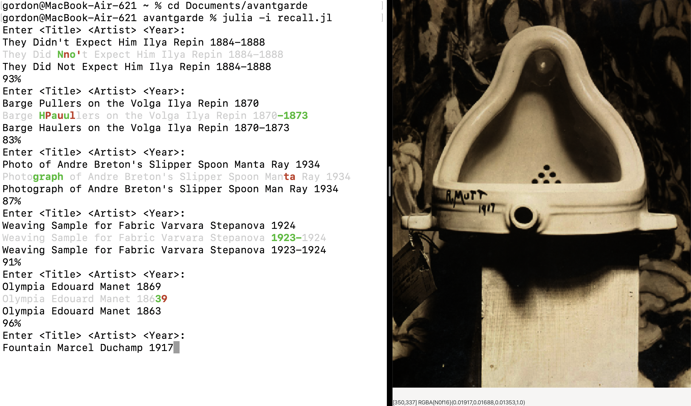

# README

Recall the Title, Artist, and Year of works of Avant-Garde art. 

Computes Levenshtein distance and shows diff of response and expected.

Minimal terminal UI aesthetic.

Computes total score.

